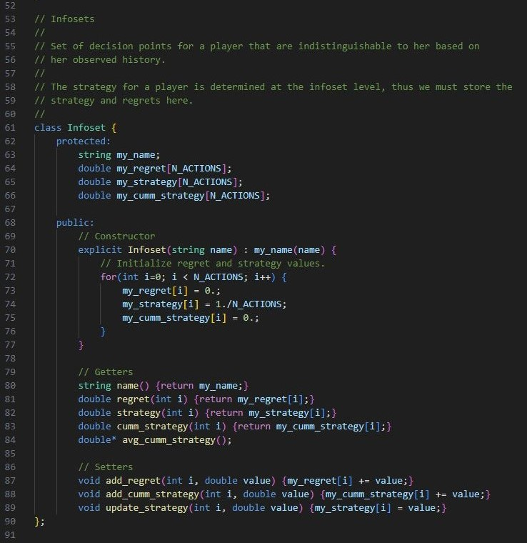

# Regret Circuits Applied to Kuhn Poker
 Regret circuit paradigm applied to Kuhn poker
   
 Inspired by [Regret Circuits: Composability of Regret Minimizers](https://arxiv.org/pdf/1811.02540.pdf).
  

***
### 1. Kuhn Poker
See the Wikipedia [page](https://en.wikipedia.org/wiki/Kuhn_poker) for a comprehensive description of the game.   

### 2. Code Design
### 2.1. Players
Kuhn poker is a two-player game. This is represented by the `player_t` enum that assigns a value of 0 and 1 to `Player1` and `Player2`, respectively.   

### 2.2. Actions
At each decision point, the players must chose an action from a set of two available actions. The set of actions depends on whether or not the player is facing a bet. When not facing a bet, the player can `Check` or `Bet`, defined by the `first_actions` set. When facing a bet, the player can `Call` or `Fold`, defined by the `second_actions` set.   

### 2.3. Cards
There are three cards in Kuhn poker (`Jack`, `Queen`, `King`), defined by the enum `card_t`.   

### 2.4. Infosets
An infoset is a set of decision points for a player that are indistinguishable to her based on her observed history. Infosets are the result of information that is hidden from the player by the environment or the player's inability to observe their opponent's actions.   

For Kuhn poker, all actions are observable. Therefore, the infosets are the result of the hidden information, the card that the player's opponent is holding. There are three total cards, the player holds one, so there are two possibilities for the opponent's card, meaning there are two decision nodes in each infoset.   

Shown below is the extensive-form game representation for Kuhn poker (taken from [Wikipedia](https://en.wikipedia.org/wiki/Kuhn_poker)) with the decision points and infosets labeled:   

By definition, each decision point in an infoset must have the same set of available actions, and the accumulated regret and strategy over those actions. If they were different, then the decision points would be distinguishable and not part of the same infoset.   

To reflect this many-to-one relationship of many decision points to a single infoset in the code, the infoset is given its own class apart from that of the decision point class.   

Each infoset is uniquely determined by three values: the player who is making the decision, whether or not that player is facing a bet, and the card that the player holds. This is shown in the global array of infoset pointers that is defined in the code. Note, this array is made global to allow each decision point to access it. Training is done sequentially, so there is no need to worry about race conditions.   

The average accumulated strategy for the infoset converages to an equilibrium.

### 2.5. Points
Each point, or node, in an extensive-form game represents a game state. The edges between points represents the transitions from one state to the next.   

There are three types of points in the game tree:  

The abstract base point class:  

The functions common to all point classes are `observe_utility` and `next_strategy`.   

`observe_utility` recursively traverses the game tree. On the downward pass, the game state and reach probabililities are propagated to the child points. On the upward pass, the point's utiltity is propagated upward to the parent points.  

`next_strategy` is called as part of the upward traversal of the game tree, once the child utilities have been used to update the accumulated regret for the infoset. This strategy is updated according to the regret matching algorithm, discussed in more detail below.   

### 2.6. Observation Points
Observation points represent the stochasticsity of the environment. Each edge emanating from a chance point represents a different outcome of the observation. Players do not know the dynamics, the probability distribution over outcomes, of the environment a priori.   

For Kuhn Poker, only one chance event occurs - the dealing of the cards to each player at the beginning of the game.   

The observation class:  

The `observe_utility` function randomly samples a child node. Here, each child node represents a different outcome of the dealt cards to each player, 6 possiblities in total. We then recurse down the game tree by calling `observe_utiltity` on the child node.  

The `next_strategy` function for the observation class has been left empty for simplicity since the observation node is always the root of the game tree in Kuhn Poker. If one wanted to accumulate a strategy for the observation node, then the convex hull of the child strategies would be taken.   

### 2.7. Decision Points
Decision points represent the player's interaction with the environment. Each decision point belongs to a single player. Each edge emanating from a decision point represents a different action available to the player.   

For Kuhn Poker, each decision point is uniquely identified by the players' cards, the player who owns the decision, and whether that player is facing a bet.   

The decision class:  

The `observe_utility` function for the decision class does the following:  
- On the downward traversal, the player passes the counterfactual reach probability to the child points (i.e. the probability of reaching the children points assuming the player is playing to reach the children points).   
- On the upward traversal, the player uses the utilities returned by the children as well as the player's strategy to compute a counterfactual value for the infoset, scaled by the counterfactual reach probability passed to it by its parent point. This counterfactual value is then used to compute the counterfactual regret for each available action (i.e. the value of only playing that action versus the counterfactual value of the infoset given the player's current strategy).   

The `next_strategy` function for the decision class takes the regrets accumulated by the `observe_utility` function and performs the regret matching algorithm to update the player's strategy at this infoset.

### 2.8. Terminal Points
Terminal points are the leafs of the game tree that return payouts to the player's.   

The terminal class:  

The `observe_utility` function simply returns the payout with respect to Player 1.  

The `next_strategy` function is void.   

### 2.9. Game Tree Initializations
See the functions `init_infosets` and `init_tree` for the initialization of the infoset and game tree objects.   

### 2.10. Main
The main function of this program loops over `observe_utility` calls to the root of the game tree. This executes the CFR algorithm and allows the players to adjust their strategies until an equilibrium is achieved.  

### 3. Results
Below is an example output of the player's strategies at each decision node after 1000000 iterations.  

This result agrees with the known equilibrium solution to Kuhn Poker.

### 4. References
Gabriele Farina, Christian Kroer, Tuomas Sandholm. Regret Circuits: Composibility of Regret Minimizers.
http://arxiv.org/abs/1811.02540.  

Todd W. Neller, Marc Lanctot. An Introduction to Counterfactual Regret Minimization.
https://www.ma.imperial.ac.uk/~dturaev/neller-lanctot.pdf.   

Marc Lanctot, Kevin Waugh, Martin Zinkevich, and Michael Bowling. Monte carlo sampling
for regret minimization in extensive games. In Y. Bengio, D. Schuurmans, J. Lafferty, C. K. I.
Williams, and A. Culotta, editors, Advances in Neural Information Processing Systems 22, pages
1078–1086. MIT Press, 2009.  

Martin Zinkevich, Michael Johanson, Michael Bowling, and Carmelo Piccione. Regret minimization
in games with incomplete information. In J.C. Platt, D. Koller, Y. Singer, and S. Roweis, editors,
Advances in Neural Information Processing Systems 20, pages 1729–1736. MIT Press, Cambridge,
MA, 2008.  

